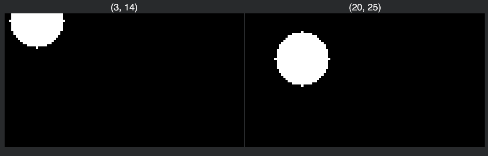

# Seal Tracking using DINOv3 and SAM
Self-supervised seal tracking pipeline using DINOv3 dense embeddings and SAM segmentation on underwater video sequences.

## Problem
Tracking seals in underwater videos without labeled data.

## Approach
- DINOv3 dense feature embeddings
- Euclidean vs Cosine similarity comparison
- SAM guided vs unguided segmentation

## Key Observations
- Euclidean distance produced broad localization.
- Cosine similarity improved alignment but was fragmented.
- Guided SAM reduced background noise significantly.

## Example Results

### Guided SAM vs Unguided

### Euclidean Localization

